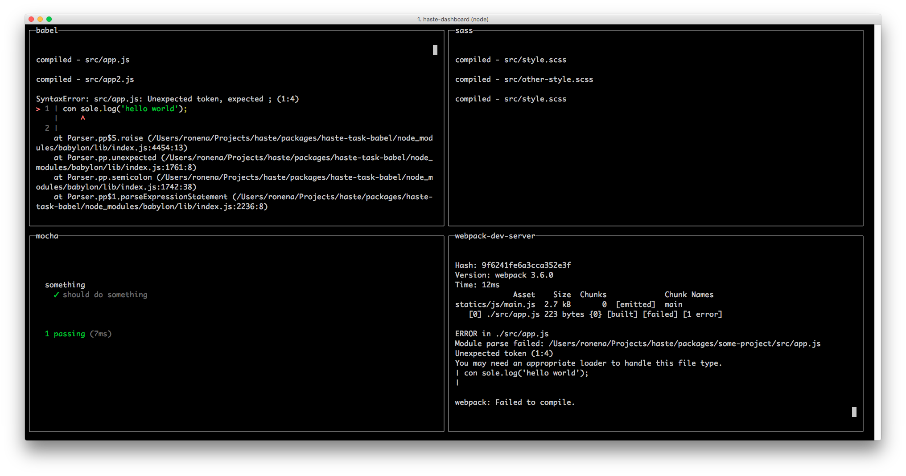

<h1 align="center">Haste</h1>

An extendable, blazing fast build system that cares about user experience

  
  
  
  
  
  

## Introduction
Haste helps you automate common tasks in your development workflow. Prioritizing performance, extendability and user experience.

## Summary
- :zap: **Blazing fast performance:** running tasks in parallel using multiple processes.
- :electric_plug: **Highly modular plugin system:** making it possible to change almost anything.
- :video_game: **Intuitive user experience:** managing output to allow the creation of loaders and dashboards.
- :rocket: **Simple, programmatic API:** leveraging ES2015's async await with a minimal API.

## Further reading
- [Getting started guide]()
- [Registry for community tasks and plugins]()
- [Writing tasks and plugins]()
- [API reference]()
- [FAQ]()

## Contributing
Please open issues and open pull requests with your ideas. For more information about contributing, see our [Contribution Guidelines](CONTRIBUTING.md).

[Good First Task](https://github.com/ronami/haste/labels/Good%20First%20Task) is a great starting point for PRs.

## License
The MIT License
